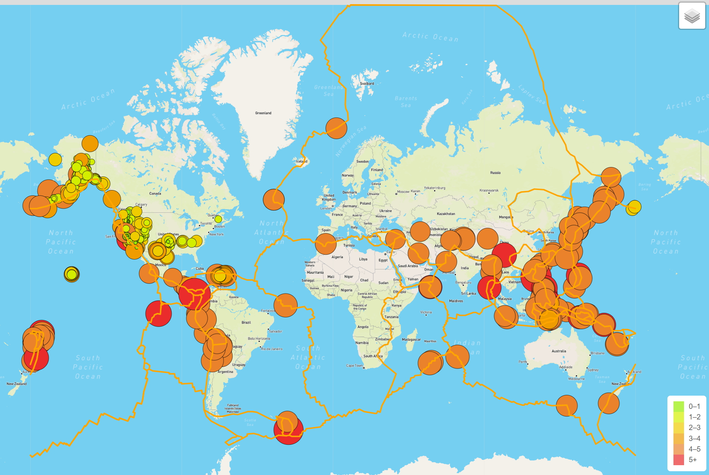

# Mapping_Earthquakes2

## Objective:

In this assignment the objective is to create layered maps using Javascript, HTML, Leaflet.js and GeoJSON data. The maps are designed to give a street view, satellite view and a streets view. The final product also has the ability to toggle between three different GeoJSON objects showing techtonic plates, all earthquakes over the last 7 days and a separate layer that only displays the major earthquakes.

## The Product

### Deliverable 1

The first part of the project was to create the map with two different views (Street and Satellite) and the ability to toggle all Earthquakes over the last seven days and overlay of the tectonic plates. Below is a screenshot of what that map looked like: 

Map Deliverable 1:

### Deliverable 2:

The second part of project was to create a layer of the map that focus primarily on the major earthquakes of the past 7 days. This layer would allow the users to hide the other earthquakes and only focus on the more powerful ones. Below is a screenshot of what that map looked like:

Map Deliverable 2:

### Deliverable 3:

The third and final part of the project was to add a third map which was completed by adding a third view of the map which is the Dark view. This view is particularly pleasing given the color and shape of the earthquake and tectonic plate data. Below is a screenshot of what that map looked like:

Map Deliverable 3:

## Conclusion

Writing working code in HTML and Javascript is extremely satisfying. This project was truly a pleasure to work on and provided many opportunities to practice debugging. The subject matter of earthquakes is also interesting. Learning about and working with GeoJSON data gives a certain unique practice towards working with all Java objects and makes this challenge particularly meaningful and I look forward to future opportunities to work with Javascript in the future. 

Pease refer to the Attached Javascript File:
[Challenge_Logic.js](./Earthquake_Challenge/static/js/challenge_logic.js)
